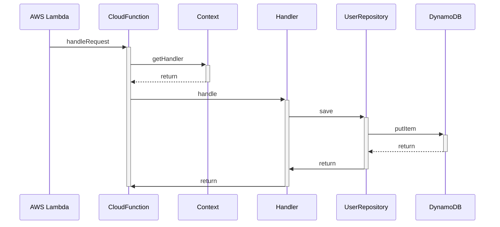
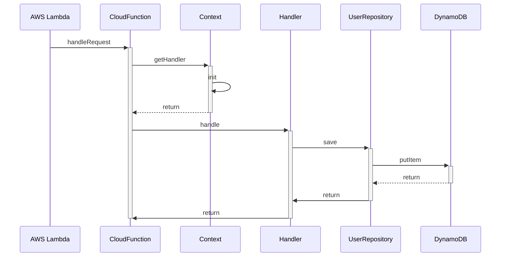

<div class="ml-60px">

# Thawing Java on AWS Lambda
## Reducing cold start times from 11 seconds to 1

<div class="text-black">
Daniel Raniz Raneland<br />
Coding Architect @ factor10

<ul class="list-none! columns-2">
  <li><mdi-email />raniz@factor10.com</li>
  <li><mdi-github />Raniz85</li>
  <li><mdi-mastodon />raniz@mastodon.online</li>

  <li><mdi-firefox />raniz.blog</li>
  <li><mdi-linkedin />/in/raneland</li>
  <li><mdi-gitlab />raniz</li>
  <li>&nbsp;</li>
</ul>
</div>
</div>

---
layout: intro
background: /images/devoxx-template.png
dim: false
---

<div class="ml-60px">

# Thawing Java on AWS Lambda
<h2 class="decoration-line-through">Reducing cold start times from 11 seconds to 1</h2>

<div class="text-black">
Daniel Raniz Raneland<br />
Coding Architect @ factor10

<ul class="list-none! columns-2">
  <li><mdi-email />raniz@factor10.com</li>
  <li><mdi-github />Raniz85</li>
  <li><mdi-mastodon />raniz@mastodon.online</li>

  <li><mdi-firefox />raniz.blog</li>
  <li><mdi-linkedin />/in/raneland</li>
  <li><mdi-gitlab />raniz</li>
  <li>&nbsp;</li>
</ul>
</div>
</div>

---
layout: intro
background: /images/devoxx-template.png
dim: false
---

<div class="ml-60px">

# Thawing Java on AWS Lambda
## Reducing cold start times from 6 seconds to .2

<div class="text-black">
Daniel Raniz Raneland<br />
Coding Architect @ factor10

<ul class="list-none! columns-2">
  <li><mdi-email />raniz@factor10.com</li>
  <li><mdi-github />Raniz85</li>
  <li><mdi-mastodon />raniz@mastodon.online</li>

  <li><mdi-firefox />raniz.blog</li>
  <li><mdi-linkedin />/in/raneland</li>
  <li><mdi-gitlab />raniz</li>
  <li>&nbsp;</li>
</ul>
</div>
</div>

---

# About Raniz


<div class="relative w-full h-full"><v-clicks>

<ul class="list-none!">
  <li class="py-4">
    <span class="inline-block text-center w-8 h-8 text-white text-110% mr-3 rounded-full bg-green">→</span>
    Master of Science in Software Development from LTH, Faculty of Engineering.
  </li>
  <li class="py-4">
    <span class="inline-block text-center w-8 h-8 text-white text-110% mr-3 rounded-full bg-green">→</span>
    Master thesis: <em>Performance- and Cost-efficient Cloud Architectures</em>.
  </li>
  <li class="py-4">
    <span class="inline-block text-center w-8 h-8 text-white text-110% mr-3 rounded-full bg-green">→</span>
    Active triathlete.
  </li>
  <li class="py-4">
    <span class="inline-block text-center w-8 h-8 text-white text-110% mr-3 rounded-full bg-green">→</span>
    In the top 4% on Stack Overflow.
  </li>
  <li class="py-4">
    <span class="inline-block text-center w-8 h-8 text-white text-110% mr-3 rounded-full bg-green">→</span>
    Worked for Sony Mobile in Tokyo to improve in-house cloud capabilities.
  </li>
  <li class="py-4">
    <span class="inline-block text-center w-8 h-8 text-white text-110% mr-3 rounded-full bg-green">→</span>
    Beer brewer and sourdough bread baker.
  </li>
</ul>
</v-clicks></div>

---
layout: center
---


---
layout: center
---


<Attribution>
Logo from Wikimedia Commons, Apache License 2.0
</Attribution>

---



---
layout: center
---

<ScatterPlot dataFile="spring-warm.json" />

<Arrow v-click class="text-red" x1="200" y1="90" x2="135" y2="115" />

<!--
Outlier in the beginning of ~6.5 seconds, the rest are sub-50 ms
-->

---
layout: cover
dim: false
background: /images/frozen-cars.jpg
---

<Attribution>
Santiago Puig Vilado, CC-BY-SA 3.0 via Wikimedia Commons
</Attribution>

<!--
Cold starts, which is why we are here
-->

---
layout: center
clicks: 10
---


<Attribution>
Image from AWS Documentation
</Attribution>

<div v-if="[1, 3, 4, 6, 7, 9, 10].includes($slidev.nav.clicks)" class="absolute red-box left-305px top-330px w-115px h-90px"></div>

<div v-if="$slidev.nav.clicks === 1" class="absolute red-box left-450px top-180px w-155px h-290px"></div>

<div v-if="$slidev.nav.clicks === 4" class="absolute red-box left-450px top-270px w-155px h-90px"></div>

<div v-if="$slidev.nav.clicks === 7" class="absolute red-box left-450px top-380px w-155px h-90px"></div>

<div v-if="$slidev.nav.clicks === 10" class="absolute red-box left-450px top-180px w-155px h-90px"></div>

<!--
4 lambdas:
- authorizer
- show
- info
- tickets

Worst case you're the first visitor and get hit by four cold starts

-->

---


---




<div class="absolute top-160px left-390px w-90px h-110px border-red border-3 rounded-5"></div>

---

# Benchmarking Cold Starts

1. Update lambda configuration
2. Wait for lambda to be ready
3. Publish a new version
4. Wait for the new version to be ready
5. Run 30 simultaneous requests
6. Collect all log tails:

    a. Record if it contains _Init Duration_\
    b. Discard if it does not

7. Repeat until we have enough measurements

---

# Cold Start Benchmarks

<ScatterPlot dataFile="spring.json" />

---
layout: cover
dim: false
dark: true
background: /images/antifreeze.jpg
---

<Attribution>
Robineero, CC-BY-SA 4.0 via Wikimedia Commons
</Attribution>

<!--
We need some antifreeze for our code.

But what is that?
-->

---

# Spring startup

1. Scan classpath
2. Figure out how to wire everything up
3. Wire everything up

---
layout: center
---


<!--
Initial release in 2018
By Greame Rocher, author of Grails
-->
---
layout: statement
---

# The Micronaut way

Your application startup time and memory consumption aren’t bound to the size of your codebase,
resulting in a _monumental leap in startup time_,
blazing fast throughput,
and a minimal memory footprint.

---

# Compile Time vs Runtime

<div class="text-center">
Spring, analyze at startup

</div>

<div v-click class="text-center">
Micronaut, analyze at compile time

</div>

---
layout: two-cols
---

# Very similar to work with

::left::

## Spring

```java
@Component
public class UserRequestHandler
        implements Function<CreateUser, User> {
    
    @Autowired
    private UserRepository userRepository;
    
    @Override
    public User apply(@Validated CreateUser input) {
```

::right::

## Micronaut

```java
@Introspected
public class UserRequestHandler
        extends MicronautRequestHandler<CreateUser, User> {

    @Inject
    private UserRepository userRepository;

    @Override
    public User execute(@Valid CreateUser input) {
```

---
layout: two-cols
---

# Very similar to work with

::left::

## Spring

```java
@Component
public class UserRepository {
    private final DynamoDbClient dynamo;
    private final String tableName;
    
    
    public UserRepository(
            DynamoDbClient dynamo,
            @Value("${user.table-name}")
            String tablename
    ) {
```

::right::

## Micronaut

```java
@Singleton
public class UserRepository {
    private final DynamoDbClient dynamo;
    private final String tableName;

    @Inject
    public UserRepository(
            DynamoDbClient dynamo,
            @Property(name="user.table-name")
            String tablename
    ) {
```

---

# Cold Start Benchmarks

<ScatterPlot dataFile="micronaut.json" />

---
layout: statement
---

# What's the real problem?

---

# Compile Time vs Runtime

<div class="text-center">
Spring, analyze at startup

</div>

<div class="text-center">
Micronaut, analyze at compile time

</div>

---

# Compile Time vs Runtime


---

# Just in Time Compilation

<div>
    <div class="text-center">Spring, JIT at startup, analyze at startup</div>
    
</div>

<div class="py-8">
    <div class="text-center">Micronaut, analyze at compile time, JIT at startup</div>
    
</div>

---

# Lambda SnapStart

## On Publish

- Start application, doing JIT and initialization
- Take snapshot

## On "Cold Start"

- Restore snapshot
- Call function

<!--
Launched in 2022.
Works with Java 11 and 17
-->

---

# Cold Start Benchmarks

<ScatterPlot dataFile="snap.json" />

---
layout: statement
---

# Drawbacks

---
layout: center
---

# Need to dry-run everything

```java
@Override
public void beforeCheckpoint(Context<? extends Resource> context) throws Exception {
    try {
        dynamoDbClient.listTables();
    } catch (Exception e) {
        e.printStackTrace();
    }
}
```

---
layout: cover
dim: false
dark: true
background: /images/retro-gadgets.jpg
---

<v-clicks>

# LTS Only

</v-clicks>

<Attribution>
Lorenzo Herrera via Unsplash
</Attribution>

---
layout: cover
dim: false
dark: true
background: /images/audi-ferrari-wec.jpg
---

<v-clicks>

# Could be Faster?

</v-clicks>

<!--

Ferrari 488 GTE: 490 hp, 1260 kg

Audio R18 e-tron quattro, 976 hp, 875 kg

-->

---
layout: statement
---

# I Want The Audi!

---
layout: center
---


---

# Rust looks very different from Java

```rust
#[derive(Serialize)]
struct User {
    id: Uuid,
    name: String,
}

async fn func(event: LambdaEvent<CreateUser>) -> Result<User, Error> {
    let (user, _context) = event.into_parts();
    let config = aws_config::load_from_env().await;
    let user = User {
        id: Uuid::new_v4(),
        name: user.name
    };
    let client = Client::new(&config);
    client.put_item()
        .table_name(env::var("USER_TABLE_NAME").unwrap())
        .item("id", AttributeValue::S(user.id.to_string()))
        .item("name", AttributeValue::S(user.name.clone()))
        .send().await?;
    Ok(user)
}
```

---

# Cold Start Benchmarks

<ScatterPlot dataFile="rust.json" />

<!--
Rust averages at around 40 ms
-->

---
layout: statement
---

# Drawbacks

---
layout: cover
background: /images/hieroglyphs.jpg
dim: false
dark: true
---

<Attribution>
Isaac Chou via Unsplash 
</Attribution>

---
layout: cover
background: /images/infant.jpg
dim: false
---

<Attribution>
Jimmy Conover via Unsplash
</Attribution>

---
layout: statement
---

# Wasn't This About Java?

---
layout: center
---


<!--
Originally intended to be self-hosting - i.e. write a JVM in Java.
Nowadays a JDK distribution based on OpenJDK that also bundles the Graal compiler.
-->

---
layout: center
---


---

# GraalVM vs JVM

<div>
    <div class="text-center">Spring, JIT at startup, analyze at startup</div>
    
</div>

<div class="py-8">
    <div class="text-center">Micronaut, analyze at compile time, JIT at startup</div>
    
</div>

<div v-click>
    <div class="text-center">"GraalVM, native compile ahead of time</div>
    
</div>

---

# Cold Start Benchmarks

<ScatterPlot dataFile="micronaut-native.json" />

<!--
Micronaut Native averages at around 200 ms
-->

---
layout: statement
---

# Drawbacks

---
layout: center
---


<Attribution>
Randal Munroe, https://xkcd.com/303 CC BY-NC 2.5
</Attribution>

<!--
Compile times, my laptop:
JVM: 1 s
Graal: 2 m 22 s, on every build
-->

---
layout: cover
dim: false
background: /images/php-hammer.jpg
---

<Attribution>
Ian Baker, flickr.com/photos/raindrift/ CC BY 2.0
</Attribution>

<!--
Tools that work with the JVM won’t work with native images. Debugging is done with GDB - which isn’t supported by IDEA for example.
-->

---
layout: cover
dim: false
background: /images/wizard.jpg
---

<Attribution>
Andrew Becraft, flickr.com/photos/dunechaser/ CC BY-NC-SA 2.0
</Attribution>

<!--
Graal requires lots of configuration to work with reflection.
Micronaut solves a lot of this,
but Micronaut can't solve what it isn't aware of.
-->

---
layout: cover
dim: false
background: /images/square-hole.jpg
---

<Attribution>
Simon Greig, flickr.com/photos/xrrr/ CC BY-NC-SA 2.0
</Attribution>

<!--
Native binaries are not portable. Not really “Write Once Run Anywhere” anymore. Cross-compilation support is currently non-existent.
The Micronaut plugin for Gradle uses Docker to build for AmazonLinux
-->

---

# Honorable Mentions

<v-clicks>

- Quarkus
- Spring Native

</v-clicks>

---

# Raniz' Flowchart for Thawing Your Lambdas

<div class="mt-15">


</div>

---
layout: intro
---

# Thawing Java on AWS Lambda
## Reducing cold start times from 6 seconds to .2

<div class="text-black">
Daniel Raniz Raneland<br />
Coding Architect @ factor10

<ul class="list-none! columns-2">
  <li><mdi-email />raniz@factor10.com</li>
  <li><mdi-github />Raniz85</li>
  <li><mdi-mastodon />raniz@mastodon.online</li>

  <li><mdi-firefox />raniz.blog</li>
  <li><mdi-linkedin />/in/raneland</li>
  <li><mdi-gitlab />raniz</li>
  <li>&nbsp;</li>
</ul>
</div>
